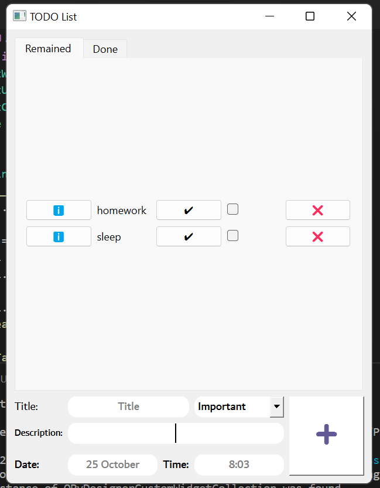

## To-Do list
- GUI to-do list written in **python** designed with **pyqt** and using **sqlite** database.
- feautures:
  - [x] Detail button
  - [x] Delete task.
  - [x] Add new task.
  - [x] Chosse priority for your task.
  - [x] Designed with 2 tabs for better user
   experience, all-tasks and Done tasks.
- views:

  
## Snake AI update
Super Snake game updated to play itself.
- A clever snake that can find the apple!
- Written in **python** using **arcade** library.

## Telegram Bot
- a telegram bot written in **python** using **py-telegrambot-api**.
- New feature:
  - making song by taking notes form the user.
